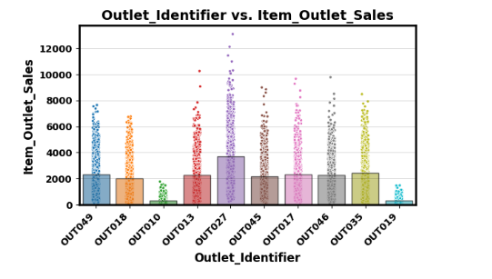
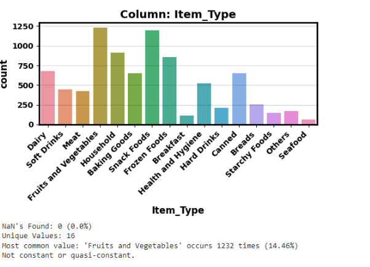

# Enhancing Outlet Sales Through Data-Driven Insights

Author: Lidivine Kengne

## Business Problem
The goal of this analysis is to improve outlet sales by utilizing data-driven insights.

## Data
The dataset used for this analysis is the Sale Prediction 2023 from Project Data Coding Dojo. It contains 8523 rows and 12 columns.

## Methods
### Data Preparation
- Load and inspect data
- Clean data: Remove duplicates, handle missing values, and correct inconsistencies

### Exploration Data
- Visualize data using histograms, box plots, and bar plots
- Provide a baseline understanding of numeric and categorical columns through univariate Exploratory Data Analysis (EDA)

## Results
- Exploratory data analysis included visualizations such as histograms and bar plots to gain insights into data distribution.
- Sales distribution across different outlets, with emphasis on OUT027, was highlighted.
- Explanatory data analysis included bar graphs and a line graph to provide insights into category comparisons and sales trends.

  
  

## Machine Learning Models Used
- Linear Regression Model
- Random Forest Regressor Model
- Tuned Random Forest Regressor Model

## Model Evaluation
### Linear Regression Model (Testing Set)
- R^2: 0.5671
- MAE: 804.1117
- RMSE: 1095.8843

### Random Forest Regressor Model (Testing Set)
- R^2: 0.5587
- MAE: 767.1537
- MSE: 1,217,517.82106161
- RMSE: 1103.4119

### Tuned Random Forest Regressor Model (Testing Set)
- MAE: 738.360
- MSE: 1,118,064.645
- RMSE: 1,057.386
- R^2: 0.595

The preferred model was the Tuned Random Forest Regressor Model with an R^2 score of 0.595, showing improved performance compared to the linear regression model.

## Overall Recommendation

## Limitations & Next Steps
- The limitations of the model are acknowledged.
- - the stores could set up a reorganization of the store to highlight the products that can be sold.
- review stock management based on sales predictions
## Contact Information
For further inquiries, please contact Lidivine Kengne at lidiviaKeng@gmail.com.
